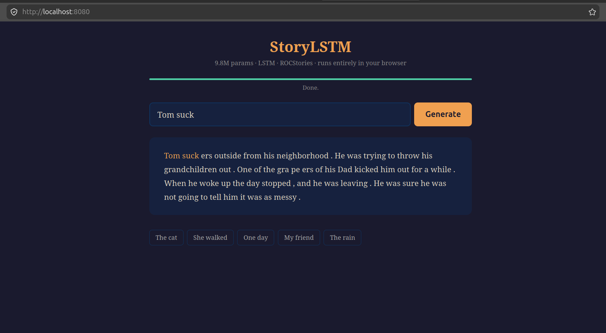

# ROCstoryteller

LSTM-based story generator trained on [ROCStories](https://cs.rochester.edu/nlp/rocstories/) — 98k five-sentence everyday stories. Give it a prompt, it writes the rest.

**9.8M parameters.** Runs in the terminal, on GPU, or directly in the browser via WebAssembly.

## Install

```bash
pip install -r requirements.txt
```

## Train

```bash
# Sentence mode (default) — <SOS>/<EOS> around each sentence
python train.py --device cuda --batch-size 128 --epochs 30

# Paragraph mode — single <SOS>…<EOS> around the whole story
python train.py --mode paragraph --device cuda --batch-size 128 --epochs 30

# Full custom
python train.py --mode paragraph --device cuda --vocab-size 16000 --hidden-dim 768 --num-layers 3 --epochs 40
```

Checkpoints saved to `checkpoints/{mode}/best_model.pt` and `checkpoints/{mode}/tokenizer.json`.

## Generate

```bash
# One-shot
python generate.py --mode paragraph --prompt "Tom went to the store" --temperature 0.8

# Interactive REPL
python play.py --mode paragraph --temperature 0.7 --device cuda
```

## Story format: two wrapping modes

The model supports two ways of wrapping stories with boundary tokens, controlled by `--mode`:

| Mode | Wrapping | Stop condition | Narrative flow |
|---|---|---|---|
| `sentence` | `<SOS> sentence. <EOS>` × 5 | 5 `<EOS>` tokens | Each sentence is a fresh start |
| `paragraph` | `<SOS> full story. <EOS>` | 1 `<EOS>` token | Continuous flow across sentences |

**Findings:** `paragraph` produces significantly more coherent stories. In `sentence` mode, the `<EOS><SOS>` boundary between sentences resets the LSTM's hidden state during training, so the model learns to produce 5 independent sentences rather than one connected story. `paragraph` mode lets the LSTM's recurrent state flow across the entire narrative, preserving character, setting, and plot across all 5 sentences.

```
sentence:   <SOS> Tom was sad. <EOS> <SOS> The doctor smiled. <EOS> ...
paragraph:  <SOS> Tom was sad. He went to the doctor. The doctor smiled. ... <EOS>
```

## Why LSTM (not Transformer)?

At the 10–20M parameter scale, a 2-layer LSTM systematically outperforms a small Transformer for text generation:

- **Parameter efficiency** — every LSTM weight is reused at every timestep. A Transformer splits its budget across per-position Q/K/V/O projections and per-head attention, diluting capacity.
- **Inductive bias** — recurrence natively encodes "what came before matters." A Transformer must learn temporal order from scratch via positional embeddings and self-attention — expensive at small scale.
- **Attention heads need dimensionality** — below ~64 dim/head, attention patterns become noise. A small Transformer with 2–4 heads quickly runs out of budget.
- **Narrative continuity** — an LSTM's hidden state flows across the entire sequence during generation, preserving context naturally. A Transformer recomputes attention for each new token, which at small scale leads to topic drift.

For a deeper discussion, see *"Are LSTMs Good Enough?"* (Merity et al., 2018) and Karpathy's experiments with nanoGPT at sub-50M scales.

## Architecture

```
Prompt: "Tom went to the store"
              │
              ▼
    ┌─────────────────────┐
    │    BPETokenizer     │   BPE 8k vocab
    │  <SOS> Tom went...  │   + <PAD> <UNK> <SOS> <EOS>
    └─────────┬───────────┘
              │ token IDs
              ▼
    ┌─────────────────────┐
    │     Embedding       │   256 dim
    └─────────┬───────────┘
              │
              ▼
    ┌─────────────────────┐
    │   LSTM × 2 layers   │   512 hidden, dropout 0.3
    └─────────┬───────────┘
              │
              ▼
    ┌─────────────────────┐
    │   Linear → Softmax  │   over vocab (8k)
    └─────────┬───────────┘
              │
              ▼
    Temperature sampling (T=0.8)
              │
              ▼
    "Tom went to the store. He bought milk.
     The cashier smiled at him. Tom felt happy.
     He decided to come back tomorrow."
```

**~10M parameters.** Trained with teacher forcing, cross-entropy loss (padding ignored), AdamW + cosine schedule, gradient clipping 1.0.

## Web demo

The model runs entirely in the browser via ONNX Runtime Web — no server, no GPU, just an HTML page.

```bash
cd web
python serve.py
# Open http://localhost:8080
```



**How it works:**
- PyTorch model exported to ONNX (FP32, 37.5 MB)
- BPE tokenizer reimplemented in ~20 lines of JS
- ONNX Runtime Web (WASM backend) runs the LSTM forward pass token-by-token
- Temperature sampling + softmax done in JS
- Generation halts after 5 `<EOS>` tokens (one per sentence)

To re-export after training a different mode:

```bash
python web/export_onnx.py --mode paragraph
```

## Project structure

```
ROCstoryteller/
├── requirements.txt
├── dataset.py        # HF datasets loader + wrapping functions
├── tokenizer.py      # BPETokenizer (HuggingFace tokenizers)
├── data_utils.py     # StoryDataset + collate (padding)
├── model.py          # StoryLSTM (Embedding → LSTM → Linear)
├── train.py          # Training loop (--mode sentence|paragraph)
├── generate.py       # CLI generation
├── play.py           # Interactive REPL
├── checkpoints/
│   ├── sentence/     # Sentence-mode model
│   └── paragraph/    # Paragraph-mode model
└── web/              # Browser demo (ONNX Runtime Web)
    ├── serve.py      # Local HTTP server
    ├── index.html    # Demo page
    ├── storylstm.onnx # Exported model (FP32)
    ├── vocab.json    # BPE vocabulary (8k tokens)
    └── config.json   # Special token IDs
```

## CLI reference

### `train.py`

| Flag | Default | Description |
|---|---|---|
| `--device` | `cpu` | `cpu` or `cuda` |
| `--mode` | `sentence` | Wrapping mode: `sentence` or `paragraph` |
| `--epochs` | `20` | Number of epochs |
| `--batch-size` | `32` | Batch size (bump to 128 on GPU) |
| `--lr` | `3e-4` | Learning rate (AdamW) |
| `--vocab-size` | `8000` | BPE vocabulary size |
| `--embed-dim` | `256` | Embedding dimension |
| `--hidden-dim` | `512` | LSTM hidden dimension |
| `--num-layers` | `2` | LSTM layers |
| `--dropout` | `0.3` | Dropout between LSTM layers |
| `--max-len` | `128` | Max token length per story |

### `generate.py`

| Flag | Default | Description |
|---|---|---|
| `--prompt` | (required) | Starting sentence(s) |
| `--mode` | `sentence` | `sentence` or `paragraph` |
| `--temperature` | `0.8` | Sampling temperature (0.6–1.0) |
| `--num-sentences` | `5` | Sentences to generate (sentence mode only) |
| `--max-tokens` | `150` | Hard token cap |
| `--device` | `cpu` | `cpu` or `cuda` |
| `--checkpoint` | (auto) | Override model path |
| `--tokenizer-path` | (auto) | Override tokenizer path |

### `play.py`

| Flag | Default | Description |
|---|---|---|
| `--mode` | `sentence` | `sentence` or `paragraph` |
| `--temperature` | `0.8` | Sampling temperature |
| `--device` | `cpu` | `cpu` or `cuda` |
| `--checkpoint` | (auto) | Override model path |
| `--tokenizer-path` | (auto) | Override tokenizer path |
